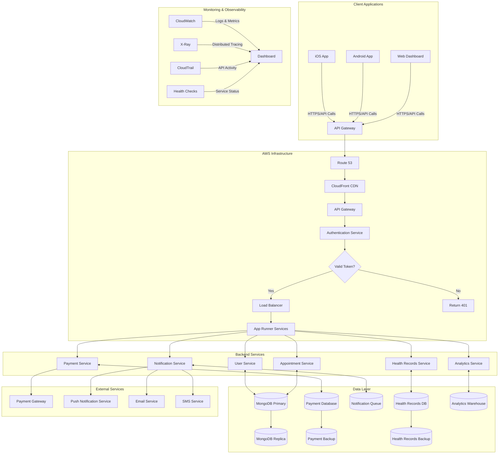
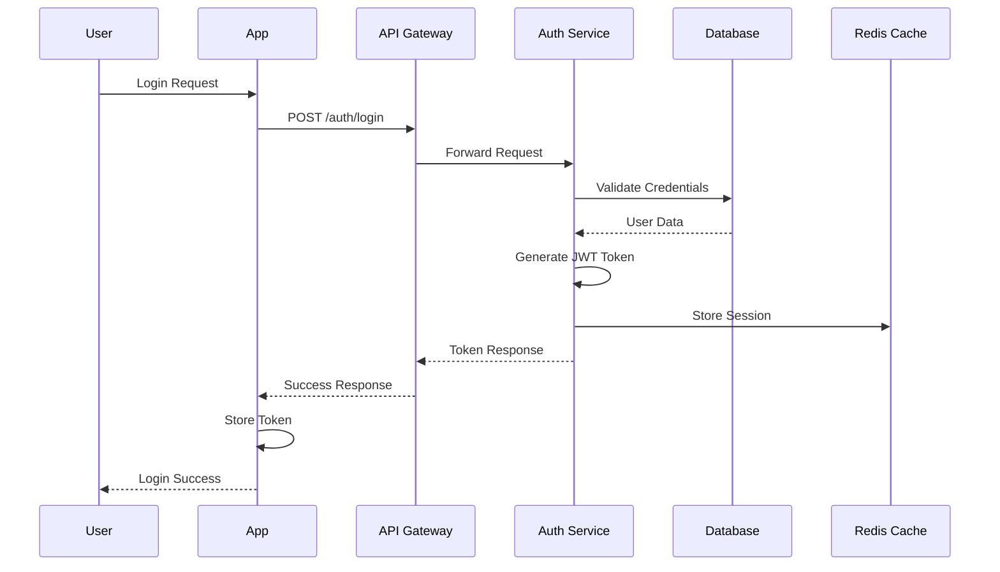
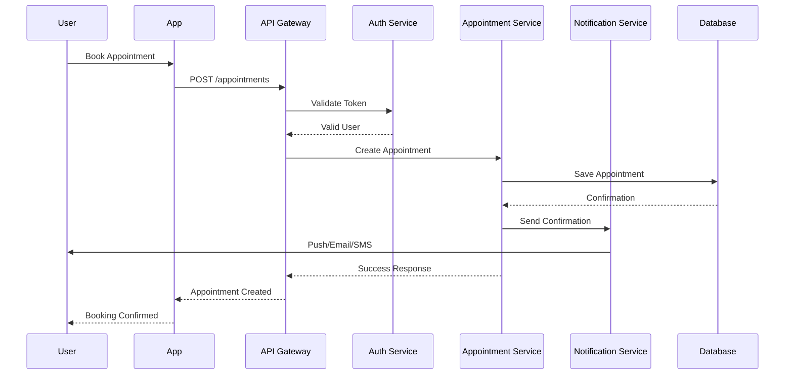

# Swasthx System Architecture

## Table of Contents
- [Overview](#overview)
- [Architecture Principles](#architecture-principles)
- [System Architecture](#system-architecture)
- [Component Details](#component-details)
- [Data Flow](#data-flow)
- [Security Architecture](#security-architecture)
- [Performance & Scalability](#performance--scalability)
- [Deployment Architecture](#deployment-architecture)
- [Monitoring & Observability](#monitoring--observability)
- [Disaster Recovery](#disaster-recovery)
- [API Architecture](#api-architecture)
- [Database Architecture](#database-architecture)
- [Integration Patterns](#integration-patterns)

## Overview

The Swasthx platform is a comprehensive healthcare management system designed to provide seamless patient care, appointment scheduling, payment processing, and real-time communication. This document outlines the high-level architecture, including its components, their interactions, and deployment strategies.

### Key Features
- **Multi-platform Support**: Native iOS and Android applications
- **Real-time Communication**: Instant notifications and messaging
- **Secure Payment Processing**: PCI DSS compliant payment handling
- **Scalable Infrastructure**: Cloud-native architecture on AWS
- **Comprehensive Monitoring**: End-to-end observability and alerting

## Architecture Principles

### 1. Microservices Architecture
- **Service Independence**: Each service can be developed, deployed, and scaled independently
- **Technology Diversity**: Services can use different technologies based on requirements
- **Fault Isolation**: Failure in one service doesn't affect others
- **Team Autonomy**: Different teams can work on different services

### 2. Security First
- **Zero Trust Model**: No implicit trust, continuous verification
- **Data Encryption**: Encryption at rest and in transit
- **Principle of Least Privilege**: Minimal access rights
- **Regular Security Audits**: Continuous security assessment

### 3. Scalability & Performance
- **Horizontal Scaling**: Add more instances to handle load
- **Caching Strategy**: Multi-layer caching for performance
- **Load Balancing**: Distribute traffic across multiple instances
- **Auto-scaling**: Automatic resource management

### 4. Reliability & Availability
- **High Availability**: 99.9% uptime target
- **Fault Tolerance**: System continues operating despite failures
- **Disaster Recovery**: Quick recovery from catastrophic failures
- **Data Backup**: Regular automated backups

## System Architecture

### Architecture Diagram

### High-Level System Flow

## Component Details

### 1. Client Layer

#### Mobile Applications
- **iOS Application**:
  - Native Swift/SwiftUI development
  - iOS 14.0+ support
  - Push notifications via APNs
  - Offline data synchronization
  - Biometric authentication support
  
- **Android Application**:
  - Native Kotlin development
  - Android 8.0+ support
  - Push notifications via FCM
  - Offline data synchronization
  - Biometric authentication support

#### Web Dashboard
- **Admin Portal**:
  - React.js frontend
  - Responsive design
  - Real-time data updates
  - Role-based access control
  - Analytics dashboard

### 2. API Gateway & Load Balancing

#### AWS API Gateway
- **Request Routing**: Routes requests to appropriate services
- **Rate Limiting**: Prevents API abuse
- **Request/Response Transformation**: Data format conversion
- **Caching**: Reduces backend load
- **API Versioning**: Supports multiple API versions

#### Application Load Balancer
- **Health Checks**: Monitors service health
- **SSL Termination**: Handles HTTPS termination
- **Session Affinity**: Maintains user sessions
- **Auto-scaling Integration**: Scales with traffic

### 3. Authentication & Authorization

#### Authentication Service
- **JWT Token Management**:
  - Token generation and validation
  - Refresh token handling
  - Token revocation
  - Token expiration management
  
- **Multi-factor Authentication**:
  - SMS-based verification
  - Email-based verification
  - TOTP support
  - Biometric authentication

#### Authorization Middleware
- **Role-based Access Control (RBAC)**:
  - User roles and permissions
  - Resource-level access control
  - Dynamic permission updates
  - Audit logging

### 4. Core Services

#### User Service
- **User Management**:
  - User registration and profile management
  - Password reset and account recovery
  - User preferences and settings
  - Account verification and validation
  
- **Profile Management**:
  - Personal information management
  - Medical history tracking
  - Emergency contact management
  - Insurance information

#### Appointment Service
- **Scheduling System**:
  - Appointment booking and cancellation
  - Availability management
  - Conflict detection and resolution
  - Recurring appointment support
  
- **Calendar Integration**:
  - Google Calendar sync
  - Outlook Calendar sync
  - Calendar export functionality
  - Reminder notifications

#### Payment Service
- **Payment Processing**:
  - Multiple payment method support
  - Secure payment gateway integration
  - Transaction history and receipts
  - Refund processing
  
- **Billing Management**:
  - Invoice generation
  - Payment plan management
  - Insurance claim processing
  - Financial reporting

#### Notification Service
- **Multi-channel Notifications**:
  - Push notifications (iOS/Android)
  - Email notifications
  - SMS notifications
  - In-app notifications
  
- **Notification Management**:
  - Notification preferences
  - Delivery status tracking
  - Notification history
  - Template management

#### Health Records Service
- **Medical Records Management**:
  - Patient medical history
  - Lab results and reports
  - Prescription management
  - Treatment plans
  
- **Data Standards**:
  - HL7 FHIR compliance
  - HIPAA compliance
  - Data interoperability
  - Standard medical codes

#### Analytics Service
- **Data Analytics**:
  - Patient analytics
  - Business intelligence
  - Performance metrics
  - Predictive analytics
  
- **Reporting**:
  - Custom report generation
  - Scheduled reports
  - Data visualization
  - Export capabilities

### 5. Data Layer

#### MongoDB Database
- **Primary Database**:
  - Self-hosted on EC2 instance
  - Replica set configuration (3 nodes)
  - Automated failover
  - Read/write separation
  
- **Data Security**:
  - Encryption at rest (LUKS)
  - Encryption in transit (TLS)
  - Network isolation (VPC)
  - Access control (IAM)

#### Caching Layer
- **Redis Cache**:
  - Session storage
  - API response caching
  - Database query caching
  - Rate limiting storage
  
- **ElastiCache**:
  - Managed Redis service
  - Automatic scaling
  - Multi-AZ deployment
  - Backup and recovery

#### File Storage
- **Amazon S3**:
  - Static asset storage
  - User file uploads
  - Backup storage
  - CDN integration
  
- **EBS Volumes**:
  - Database storage
  - Application logs
  - Configuration files
  - Temporary data

## Data Flow

### User Authentication Flow

### Appointment Booking Flow

## Security Architecture

### Network Security
- **VPC Configuration**:
  - Private subnets for backend services
  - Public subnets for load balancers
  - NAT gateways for outbound traffic
  - Security groups for access control

### Data Security
- **Encryption**:
  - TLS 1.3 for data in transit
  - AES-256 for data at rest
  - Key management via AWS KMS
  - Certificate management

### Access Control
- **Identity Management**:
  - AWS IAM for service access
  - JWT tokens for API access
  - Role-based permissions
  - Multi-factor authentication

### Compliance
- **Healthcare Standards**:
  - HIPAA compliance
  - HITECH Act compliance
  - SOC 2 Type II certification
  - Regular security audits

## Performance & Scalability

### Performance Optimization
- **Caching Strategy**:
  - CDN for static assets
  - Redis for session data
  - Database query caching
  - API response caching

### Scalability Patterns
- **Horizontal Scaling**:
  - Auto-scaling groups
  - Load balancer distribution
  - Database read replicas
  - Microservices architecture

### Performance Monitoring
- **Metrics Collection**:
  - Response time monitoring
  - Throughput measurement
  - Error rate tracking
  - Resource utilization

## Deployment Architecture

### Development Environment
- **Local Development**:
  - Docker Compose setup
  - Local database instances
  - Mock external services
  - Hot reloading

### Staging Environment
- **Pre-production Testing**:
  - Production-like configuration
  - Automated testing
  - Performance testing
  - Security testing

### Production Environment
- **High Availability**:
  - Multi-AZ deployment
  - Auto-scaling configuration
  - Load balancer setup
  - Database replication

## Monitoring & Observability

### Logging Strategy
- **Centralized Logging**:
  - CloudWatch Logs
  - Structured JSON logging
  - Log aggregation
  - Log retention policies

### Metrics & Monitoring
- **Application Metrics**:
  - Custom CloudWatch metrics
  - Performance dashboards
  - Alerting rules
  - Capacity planning

### Distributed Tracing
- **Request Tracing**:
  - AWS X-Ray integration
  - Service dependency mapping
  - Performance bottleneck identification
  - Error correlation

## Disaster Recovery

### Backup Strategy
- **Data Backup**:
  - Automated daily backups
  - Point-in-time recovery
  - Cross-region backup storage
  - Backup verification

### Recovery Procedures
- **Recovery Time Objectives (RTO)**:
  - Database recovery: < 4 hours
  - Application recovery: < 1 hour
  - Full system recovery: < 8 hours

### Business Continuity
- **Failover Procedures**:
  - Automated failover
  - Manual failover procedures
  - Data consistency checks
  - Service validation

## API Architecture

### RESTful API Design
- **API Standards**:
  - RESTful principles
  - HTTP status codes
  - JSON response format
  - API versioning

### API Documentation
- **OpenAPI Specification**:
  - Swagger documentation
  - Interactive API explorer
  - Code examples
  - SDK generation

### API Security
- **Authentication**:
  - JWT token validation
  - API key management
  - Rate limiting
  - Request signing

## Database Architecture

### Data Modeling
- **Schema Design**:
  - Normalized data structure
  - Index optimization
  - Query performance
  - Data integrity

### Data Migration
- **Migration Strategy**:
  - Zero-downtime migrations
  - Rollback procedures
  - Data validation
  - Performance impact

### Data Archival
- **Archival Policy**:
  - Automated archival
  - Data lifecycle management
  - Storage optimization
  - Compliance requirements

## Integration Patterns

### External Integrations
- **Payment Gateways**:
  - Stripe integration
  - PayPal integration
  - Local payment methods
  - Webhook handling

### Third-party Services
- **Notification Services**:
  - Firebase Cloud Messaging
  - SendGrid for emails
  - Twilio for SMS
  - Webhook notifications

### Healthcare Integrations
- **EHR Systems**:
  - HL7 FHIR integration
  - Epic integration
  - Cerner integration
  - Custom EHR adapters

---

## Related Documentation

- [AWS Resources](/docs/aws-resources/) - Detailed AWS infrastructure documentation
- [API Documentation](/docs/api-documentation/) - Complete API reference
- [Database Guide](/docs/mongodb-guide/) - MongoDB setup and management
- [Deployment Guide](/docs/deployment-guide/) - Deployment procedures and best practices
- [Security Guidelines](/docs/security-guidelines/) - Security policies and procedures

---

*Last updated: {{ site.time | date: "%B %d, %Y" }}*
