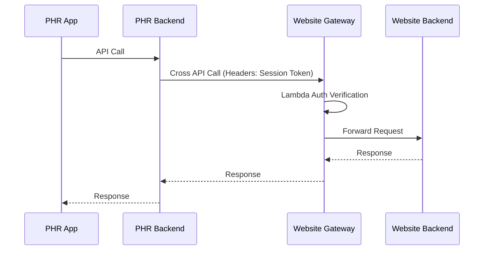

# Cross API Documentation

This document outlines the API communication flow between the PHR Backend and the Website Backend, specifically detailing the Cross API calls initiated from the PHR side.

## Overview

There are specific scenarios where the PHR App needs to access data or perform actions that reside on the Website Backend. In these cases, the PHR Backend acts as an intermediary, forwarding the request to the Website Backend.

## System Flow

The cross-api communication follows this sequence:

1.  **PHR App Request**: The PHR App initiates a request to the PHR Backend.
2.  **PHR Backend Processing**: The PHR Backend receives the request and identifies the need to call the Website Backend.
3.  **Forwarding**: The PHR Backend makes an HTTP request to the Website Backend API.
    *   **Authentication**: The session token is passed in the request `headers`.
4.  **Website Gateway Auth**: The Website Gateway intercepts the request and uses a Lambda function to authenticate the call (verifying the session token).
5.  **Website Backend**: On successful authentication, the request reaches the Website Backend logic.
6.  **Response**: The Website Backend processes the request and sends the response back to the PHR Backend, which then relays it to the PHR App.

## Involved Collections

The following collections in the **Website Database** are involved in these API interactions:

*   `PatientInfoModel`
*   `PatientAppointmentModel`
*   `DoctorProfile`
*   `DoctorSlot`
*   `userVitalAssessment`
*   `BookedSlot`

## List of Cross APIs

The following APIs are called from the PHR Backend to the Website Backend:

*   `/cancelUserSlot`
*   `/rescheduleAppointment`
*   `/doctor-profile/getProfile`
*   `/submitUserVitalAssessment`
*   `/userSlotBook`
*   `/getAppointmentsByIds`
*   `/doctor-profile/cancelAppointment/`
*   `/getAllDoctorsByIds`
*   `/doctor-profile/popularDoctors`
*   `/doctor-profile/getSchedule/`
*   `/doctor-profile/getBookedSlots`
*   `/doctor-profile/fethcAllProfile?`
*   `/doctor-profile/nearbyDoctors`
*   `/doctor-profile/newFilters`
*   `/doctor-profile/searchDocName`
*   `/doctor-profile/getDoctorFaq`
*   `/getAllAppointments`
