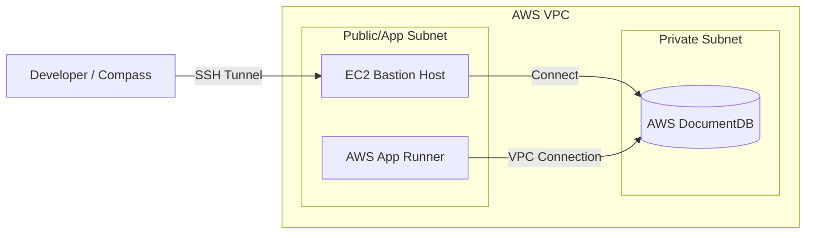

# Swasthx System Architecture

This document provides a detailed technical overview of the Swasthx platform architecture, covering the PHR Mobile Application, Website/Portals, and the underlying cloud infrastructure on AWS.

---

## 📖 How to Read Architecture Diagrams

To help you understand the architecture diagrams given in this section, please refer to this legend:

| Symbol | Representation | Description |
| :--- | :--- | :--- |
| **Rectangle** | `[Component]` | Represents a service, application, or AWS resource (e.g., API Gateway, App Runner). |
| **Cylinder** | `[(Database)]` | Represents data storage systems (e.g., DocumentDB, S3 Buckets). |
| **Solid Line** | `-->` | Synchronous request or direct data flow (e.g., API call). |
| **Dotted Line** | `-.->` | Asynchronous communication or callback (e.g., Webhook). |
| **Subgraph** | `Box` | Groups related components (e.g., "AWS Infrastructure", "Data Layer"). |

---

<div data-context="phr" markdown="1">

## 1. PHR App Architecture

The Personal Health Record (PHR) application enables patients to manage their health data.

### Tech Stack
-   **Frontend**: React Native (Android & iOS).
-   **Backend**: Nest.js Framework.
-   **Infrastructure**: AWS Cloud (App Runner, API Gateway, etc.).

### System Flow
1.  **Request Entry**: Use specific requests (HTTPS) initiated from the Android/iOS app.
2.  **API Gateway**: All requests first hit the **AWS API Gateway**.
    -   **Authentication**: The gateway validates the JWT token.
    -   **Routing**: Valid requests are routed to the backend service.
3.  **Backend Execution**:
    -   Requests are processed by **AWS App Runner** running the Nest.js application.
    -   **Environment**: Secrets and environment variables are configured directly in AWS App Runner.
4.  **Data Persistence**:
    -   Core data is stored in **AWS DocumentDB** (MongoDB compatible).
    -   Images/Files are stored in **Amazon S3**.
5.  **External Communication**:
    -   SMS notifications are sent using **AWS SNS**.
    -   Deep integration with **ABDM** (Ayushman Bharat Digital Mission).

### ABDM Integration Flow
-   **Outbound**: Backend makes calls to ABDM servers for discovery, linking, etc.
-   **Inbound (Callbacks)**: ABDM sends asynchronous responses via webhooks.
    -   **API Gateway** intercepts these callbacks.
    -   Routes them to the specific backend handler in App Runner.

### PHR Architecture Diagram

```mermaid
graph TD
    subgraph "Client"
        App[PHR Mobile App <br/> (React Native)]
    end

    subgraph "AWS Infrastructure"
        R53[Route 53 <br/> Domain Service]
        Gw[AWS API Gateway <br/> (Auth & Routing)]
        Runner[AWS App Runner <br/> (Nest.js Backend)]
        
        subgraph "Data & Storage"
            DocDB[(AWS DocumentDB)]
            S3[Amazon S3 <br/> (Images/Docs)]
        end
        
        subgraph "Services"
            SNS[AWS SNS <br/> (SMS Service)]
        end
    end

    subgraph "External"
        ABDM[ABDM Network]
    end

    App -->|HTTPS| R53
    R53 --> Gw
    Gw -->|1. Token Auth| Gw
    Gw -->|2. Forward Request| Runner
    
    Runner -->|Read/Write| DocDB
    Runner -->|Store/Retrieve| S3
    Runner -->|Send SMS| SNS
    
    %% ABDM Flow
    Runner -->|API Call| ABDM
    ABDM -.->|Callback Webhook| Gw
```

### Cloud Infrastructure Diagram (Mobile App)


</div>

---

<div data-context="website" markdown="1">

## 2. Website & Portals Architecture

The Swasthx Website and Doctor Portals provide interfaces for patients and providers via web browsers.

### Tech Stack
-   **Frontend**: React.js.
-   **Hosting**: AWS Amplify.
-   **Backend**: Nest.js Framework.

### System Flow
1.  **Frontend Delivery**: The React application is hosted and served via **AWS Amplify**.
2.  **API Routing**: API requests from the browser are directed to **AWS API Gateway** (mapped via Route 53).
3.  **Backend Processing**:
    -   Similar to the PHR app, the backend runs on **AWS App Runner**.
    -   **Configuration**: Environment variables are managed in App Runner + **AWS Secrets Manager** for sensitive credentials.
4.  **Database & Storage**:
    -   Shares the same **AWS DocumentDB** cluster for data.
    -   Uses **Amazon S3** for file storage.
5.  **ABDM Integration**: Same flow as PHR, handling callbacks via API Gateway.

### Website Architecture Diagram

```mermaid
graph TD
    subgraph "Client Browser"
        Web[React.js Website]
    end

    subgraph "AWS Frontend"
        Amplify[AWS Amplify <br/> (Hosting & CD)]
    end

    subgraph "AWS Backend Infrastructure"
        R53[Route 53]
        Gw[AWS API Gateway]
        Runner[AWS App Runner <br/> (Nest.js)]
        Secret[AWS Secrets Manager]
        
        subgraph "Data"
            DocDB[(AWS DocumentDB)]
            S3[Amazon S3]
        end
    end

    Web -->|Load Assets| Amplify
    Web -->|API Calls| R53
    R53 --> Gw
    Gw --> Runner
    
    Runner -->|Get Config| Secret
    Runner --> DocDB
    Runner --> S3
```

### Cloud Infrastructure Diagram (Website)


</div>

---

## 3. Shared Infrastructure & Network Security

### Virtual Private Cloud (VPC)
To ensure security and low latency, critical components are isolated within the same **AWS VPC**:
-   **AWS App Runner** (VPC Connector enabled)
-   **AWS DocumentDB** (Private Subnet)
-   **EC2 Bastion Host** (See below)

### Database Access
**AWS DocumentDB** runs in a private subnet and is not accessible from the public internet. 
-   **Compass Access**: An **EC2 instance** is deployed in the same VPC to act as a jump server/bastion.
-   Developers connect to this EC2 instance via SSH tunnel to access DocumentDB using MongoDB Compass.

### Network Diagram



---

## 4. Summary of AWS Resources

| Service | Purpose |
| :--- | :--- |
| **AWS Amplify** | Hosting and CI/CD for React Frontend. |
| **AWS API Gateway** | Entry point for APIs, Authentication, Routing, and ABDM Callback handling. |
| **AWS App Runner** | Containerized backend service (Nest.js). Auto-scaling and load balancing. |
| **AWS DocumentDB** | Managed NoSQL database (MongoDB compatible). Secure and scalable. |
| **Amazon S3** | Object storage for images, prescriptions, and static assets. |
| **AWS SNS** | Simple Notification Service for sending SMS. |
| **Route 53** | DNS management and domain registration. |
| **EC2** | Bastion host for secure database access. |
| **Secrets Manager** | Secure storage for website backend credentials. |
