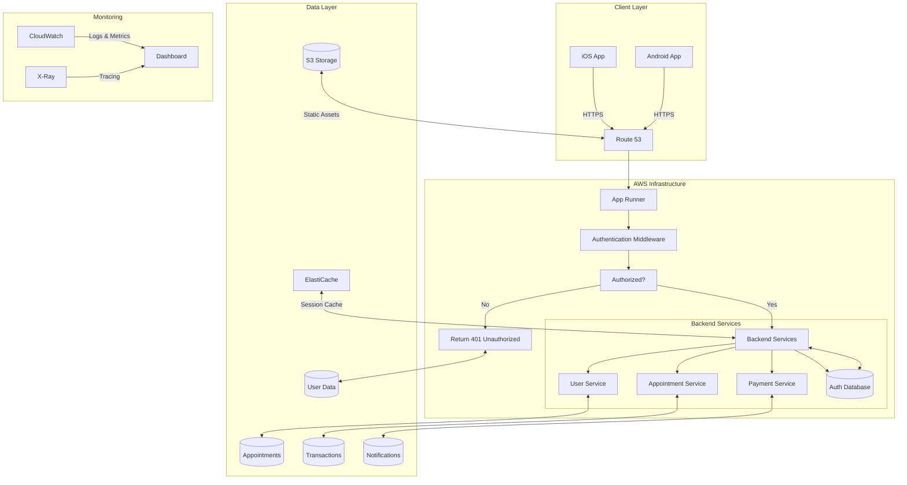

# Swasthx System Architecture

## Overview

This document outlines the high-level architecture of the Swasthx platform, including its components, their interactions, and deployment strategies.

## Architecture Diagram

## Component Details

### 1. Client Layer
- **Mobile Applications**:
  - Native iOS and Android apps
  - Direct HTTPS communication with backend
  - Token-based authentication
  - Offline capability with local data sync

### 2. Request Flow
1. **DNS Resolution**:
   - Requests first hit Route 53 for DNS resolution
   - Route 53 routes traffic to the appropriate App Runner service

2. **App Runner**:
   - Hosts the backend API services
   - Handles request routing and load balancing
   - Manages automatic scaling based on traffic

3. **Authentication Middleware**:
   - Validates JWT tokens in the request headers
   - Enforces role-based access control
   - Handles token refresh flow

### 3. Application Layer
- **Authentication Service**: JWT-based auth, OAuth 2.0, and role-based access
- **User Service**: Manages user profiles and preferences
- **Appointment Service**: Handles scheduling and management
- **Payment Service**: Processes transactions and billing
- **Notification Service**: Real-time alerts and communications
- **Encryption/Decryption API**:
  - Hosted on MongoDB EC2 instance
  - Handles data encryption at rest and in transit
  - Used by backend services for secure data handling

### 4. Data Layer
- **MongoDB Database**:
  - Self-hosted on EC2 instance
  - Replica set configuration for high availability
  - Regular automated backups
  - Data encryption at rest using LUKS
  - Network isolation in private subnet
- **Cache & Session Management**:
  - Redis for caching and session storage
  - In-memory caching for improved performance
- **Storage**:
  - Amazon S3 for static assets and file uploads
  - EBS volumes for MongoDB data persistence
  - Regular snapshots for disaster recovery

### 5. Infrastructure
- **Backend Hosting**: 
  - Containerized applications deployed on AWS App Runner
  - Automatic scaling based on traffic
  - Managed load balancing and SSL termination
- **CI/CD Pipeline**:
  - GitHub Actions for automated builds and deployments
  - Automated testing before deployment
  - Blue/Green deployment strategy
- **Monitoring & Observability**:
  - AWS CloudWatch for centralized logging and metrics
  - AWS X-Ray for distributed tracing
  - Custom dashboards with CloudWatch Dashboards
  - Alerting and notifications via SNS

## Deployment Architecture

### Development Environment
- Local development with Docker Compose
- Feature branch deployments for testing

### Staging Environment
- Mirrors production configuration
- Used for QA and UAT

### Production Environment
- Multi-AZ deployment for high availability
- Auto-scaling groups for dynamic load management
- Blue/Green deployments for zero-downtime updates

## Logging Strategy

### Current State
- Basic application logging to local files
- Limited log retention and analysis capabilities
- Manual log inspection required for debugging

### Future Implementation (AWS CloudWatch)
- **Centralized Logging**:
  - Application logs streamed to CloudWatch Logs
  - Structured logging with JSON format
  - Custom log groups for different services
  
- **Log Processing**:
  - CloudWatch Logs Insights for querying logs
  - Metric filters for monitoring error rates
  - Custom dashboards for log visualization
  
- **Retention & Archiving**:
  - 90-day retention for active logs
  - Automated archival to S3 for long-term storage
  - Lifecycle policies for cost optimization

- **Alerts & Notifications**:
  - Real-time alerts on critical errors
  - Scheduled reports on application health
  - Integration with SNS for notifications

## Security Considerations
- End-to-end encryption (TLS 1.3+)
- VPC with private subnets for backend services
- Secrets management using AWS Secrets Manager
- Regular security audits and penetration testing
- All logs encrypted at rest and in transit

## Performance
- Global CDN for static assets
- Database read replicas for read-heavy operations
- Caching at multiple layers (CDN, API, Database)
- Connection pooling and query optimization

For detailed information about AWS resources, please refer to the [AWS Resources](/Swasthx-documentation/aws-resources/) documentation.
