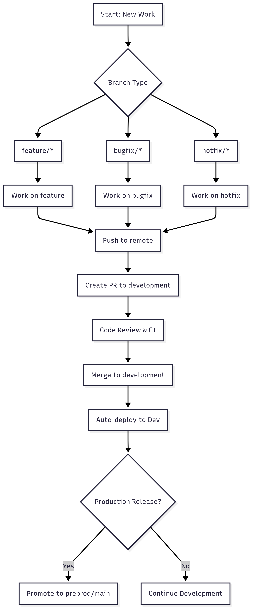

# Swasthx Branching Strategy & Deployment Policy

This document outlines our Git workflow structure, naming conventions, and CI/CD rules for contributing to the Swasthx API backend repository. All developers must adhere to this standard to maintain a clean, secure, and automated release process.

## Branching Model

### Workflow Diagram



### Branching Strategy Table

| Branch | Purpose | Deployment |
|--------|---------|------------|
| `main` | Reserved for production-ready releases | Manual (if used) |
| `preprod` | Last-mile testing and approval environment | Auto-deployed |
| `development` | Integrated working branch for all completed features | Optional QA |
| `feature/*` | Individual features or bug fixes | N/A (via PRs) |

### Feature Branch Naming Policy

All new work must follow this format:
```
feature/{short-description}
```

**Examples:**
- `feature/login-api`
- `feature/fix-scroll`
- `feature/add-appointment-service`

**Not allowed:**
- `feature/1234-login-api`
- `bugfix/navbar`
- `hotfix/image-issue`

PRs with invalid branch names will be blocked by GitHub Actions.

## Workflow for Developers

### 1. Create a Feature Branch
```bash
git checkout development
git pull origin development
git checkout -b feature/login-api
```

### 2. Push to Remote
```bash
git push origin feature/login-api
```

### 3. Open a Pull Request (PR)
- Source: `feature/...`
- Target: `development`
- Ensure CI checks pass and get reviews.

### 4. Merge to development
After successful review and test validation.

### 5. Promote to Preprod
- PR from `development` → `preprod`.
- Only `development` is allowed to merge into `preprod`.
- Deployment to AWS App Runner is automated on `preprod` push.

## GitHub Enforcement

### Branch Protection
- `preprod` and `development` branches are protected.
- Require pull requests
- Block direct pushes
- Require status checks

### Merge Restrictions
- PRs into `preprod` are only accepted if the source is `development`.
- Enforced via GitHub Actions.

### Branch Name Enforcement
- PRs must originate from `feature/{short-description}`
- Allowed exceptions:
  - `development`
  - `preprod`

## CI/CD Integration

**Triggered On:**
- Push to `preprod` → Automatically deploy to AWS App Runner

**GitHub Actions Workflows Used:**
1. `restrict-preprod-merges.yml`: Ensures only `development` → `preprod` merges
2. `enforce-branch-name.yml`: Validates branch name format for all PRs
3. `deploy-to-apprunner.yml`: Builds Docker image & deploys to App Runner on `preprod` push

## Automated Deployment Triggers

Our CI/CD pipeline is configured so that **any time a feature, hotfix, or bugfix branch is merged into the `development` branch**, an automated deployment is triggered for the development environment.

- **Trigger:** Merge to `development` from `feature/*`, `hotfix/*`, or `bugfix/*`
- **Repository:** [swasthx_Backend](https://github.com/Swasthx/swasthx_Backend)
- **Deployment Target:** Development environment (dev server)
- **CI/CD Tool:** GitHub Actions

### Deployment Flow
1. Developer creates a feature, hotfix, or bugfix branch from `development`.
2. Work is completed and a pull request (PR) is opened to merge into `development`.
3. After code review and approval, the PR is merged.
4. **On merge, the CI/CD pipeline automatically builds and deploys the latest code to the development environment.**
5. Developers can immediately test their changes on the dev server.

### Example Branches That Trigger Deployment
- `feature/login-api`
- `bugfix/appointment-timezone`
- `hotfix/payment-crash`

### Notes
- Direct pushes to `development` are blocked; all changes must go through PRs.
- Only merges from `feature/*`, `bugfix/*`, or `hotfix/*` branches will trigger deployment.
- The same process applies for other environments (e.g., merging to `preprod` or `main` for staging/production deployments), but this section focuses on the development environment.

## Contributor Tips
- Always branch from `development`
- Keep branches focused and short-lived
- Use kebab-case for clarity in branch names
- Don't push to `preprod` or `development` directly
- Always use PRs with reviews

- `main` - Production-ready code
- `develop` - Integration branch for features

## Supporting Branches

- `feature/` - New features being developed
- `bugfix/` - Bug fixes
- `release/` - Release preparation
- `hotfix/` - Critical production fixes

## Workflow

1. Create a feature branch from `develop`
2. Work on your feature
3. Create a pull request to `develop`
4. After review and testing, merge to `develop`
5. When ready for release, create a release branch
6. After final testing, merge to `main` and tag the release
